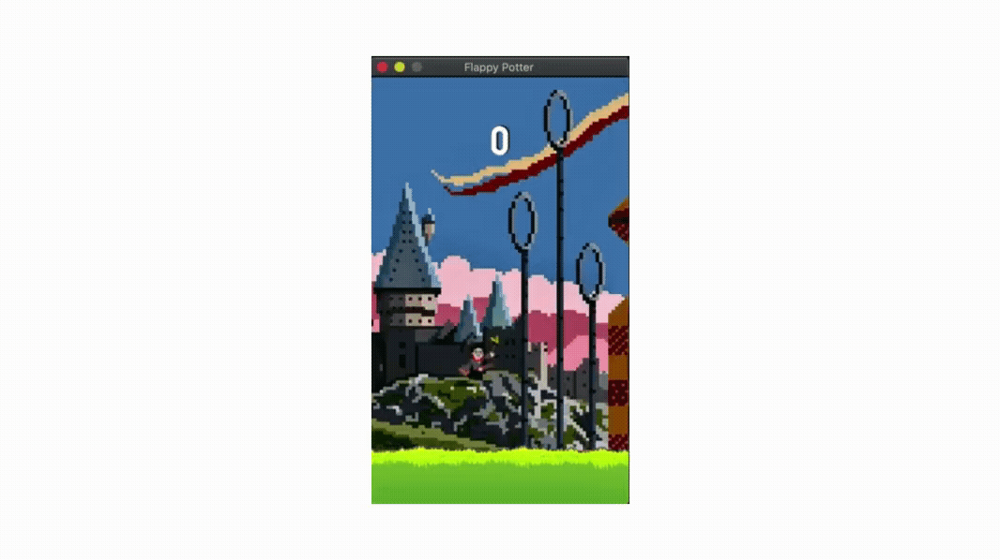

# Flappy Bird ft.(Harry Potter)
Python Game Development

A modified version of Flappy Bird, built using [PyGame](https://www.pygame.org/), with customized graphics.

## Inspiration
Despite of always wanted to learn python from my undergrad days, Finally I did but I never built a game before! I knew someday that I will make a game and learn the process. Most of this project involved Studying the process and customizing the code from my understanding. [existing code](https://github.com/popadi/python-flappy-bird). While I was on it, I also added my own fun ideas.

## Installation
1. Install Python 3.7.x if necessary (instuctions [here](https://realpython.com/installing-python))

    `$ python --version  # check version number if you're not sure`

2. Install PyGame

    `$ python3 -m pip install -U pygame --user`

## Usage
#### To run the game:
    $ python FlappyPotter.py

#### To play the game:
1. Press <kbd>Space</kbd> to start the game and to move harry up or down.
2. The objective is to keep the dog 'flying' and squeeze between the obstacles. Once harry collides with an obstacle, he will fall, signaling the end of a game. Press any <kbd>key</kbd> to start a new round.
3. The game can be exited at any time by pressing <kbd>Esc</kbd>.

## Thanks

* [Python Flappy Bird Project](https://github.com/popadi/python-flappy-bird) - All of the code presented here is based off this project.

## knowledge Resources

* [PyGame Primer](https://realpython.com/pygame-a-primer/) - A quick tutorial on PyGame that you can follow along with.
* [PyGame Tutorial](https://www.youtube.com/watch?v=FfWpgLFMI7w) - A great (2 hour) PyGame tutorial by FreeCodeCamp.
